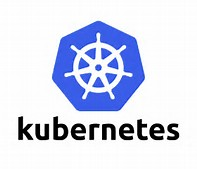
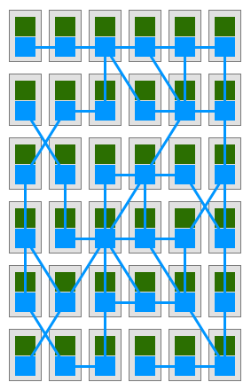
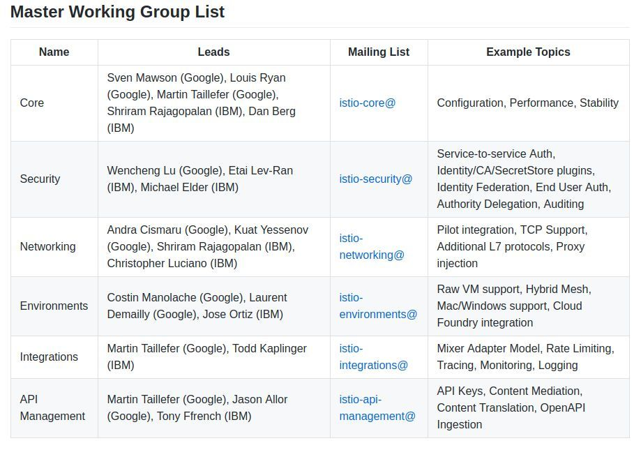
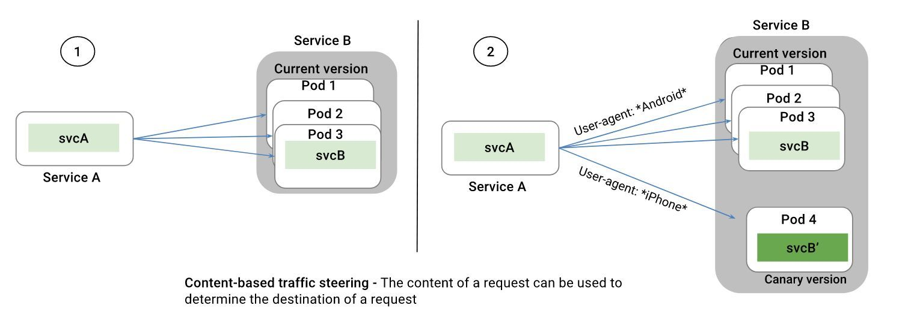
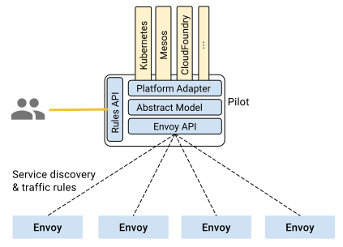
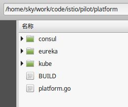
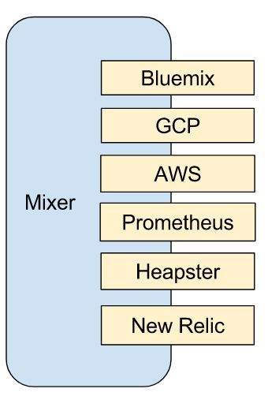
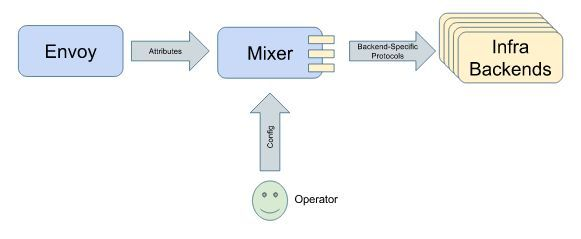
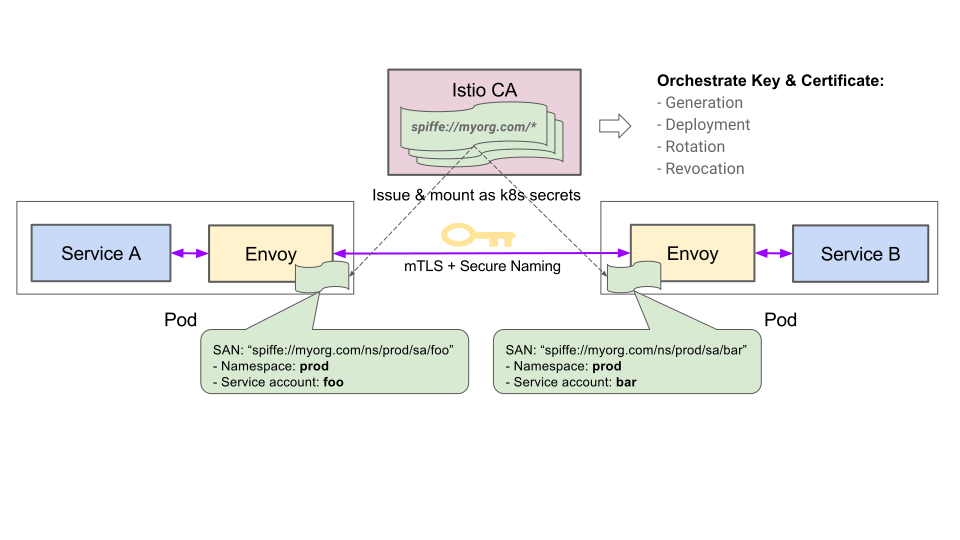

# Istio:服务网格新生力量

tags: 敖小剑

> 背景：这是2017年9月的一次线上分享的内容整理。这是Istio技术在国内第一次详细介绍。
>
> 作者：敖小剑
>
> 内容简介: Service Mesh新秀，初出茅庐便声势浩荡，前有Google，IBM和lyft倾情奉献，后有业界大佬俯首膜拜，这就是今天将要介绍的主角，扛起Service Mesh大旗，掀起新一轮微服务开发浪潮的Istio！
_ _ _

大家晚上好，欢迎参与直播，我是今天的讲师，来自数人云的资深架构师，敖小剑。

相信大家进来前都有看到这次分享的介绍，今天的主角名叫 istio，我估计很多同学在此之前可能完全没有听过这个名字。请不必介意，没听过很正常，因为istio的确是一个非常新的东西，出世也才四个月而已。

今天的内容将会分成三个部分:

1. 介绍： 让大家了解istio是什么，以及有什么好处，以及istio背后的开发团队
2. 架构： 介绍istio的整体架构和四个主要功能模块的具体功能，这块内容会比较偏技术
3. 展望： 介绍istio的后续开发计划，探讨未来的发展预期

* * *

# 介绍

## istio是什么

istio是Google/IBM/Lyft联合开发的开源项目,2017年5月发布第一个release 0.1.0, 官方定义为:

**Istio：一个连接，管理和保护微服务的开放平台。**

按照isito文档中给出的定义:

> Istio提供一种简单的方式来建立已部署的服务的网络，具备负载均衡，服务到服务认证，监控等等功能，而**不需要改动任何服务代码**。

简单的说，有了istio，你的服务就不再需要任何微服务开发框架（典型如spring cloud，dubbo），也不再需要自己动手实现各种复杂的服务治理的功能（很多是spring cloud和dubbo也不能提供的，需要自己动手）。只要服务的客户端和服务器可以进行简单的直接网络访问，就可以通过将网络层委托给istio，从而获得一系列的完备功能。

可以近似的理解为：

**istio = 微服务框架 + 服务治理**

### 名字和图标

Istio来自希腊语，英文意思是"sail", 翻译为中文是“启航”。它的图标如下:


可以类比google的另外一个相关产品,Kubernetes,名字也是同样起源于古希腊，是船长或者驾驶员的意思。下图是Kubernetes的图标:



后面我们会看到, istio和kubernetes的关系,就像他们的名字和图标一样, 可谓"一脉相传".

### 主要特性

Istio的关键功能:

- HTTP/1.1，HTTP/2，gRPC和TCP流量的自动区域感知负载平衡和故障切换。
- 通过丰富的路由规则，容错和故障注入，对流行为的细粒度控制。
- 支持访问控制，速率限制和配额的可插拔策略层和配置API。
- 集群内所有流量的自动量度，日志和跟踪，包括集群入口和出口。
- 安全的服务到服务身份验证，在集群中的服务之间具有强大的身份标识。

这些特性我们在稍后的架构章节时会有介绍.

## 为什么要使用Istio？

在深入istio细节之前,我们先来看看,为什么要使用Istio？它可以帮我们解决什么问题?

### 微服务的两面性

最近两三年来微服务方兴未艾, 我们可以看到越来越多的公司和开发人员陆陆续续投身到微服务架构, 我们也看到一个一个的微服务项目落地.

但是, 在这一片叫好的喧闹中, 我们还是发觉一些问题,普遍存在的问题: 虽然微服务对开发进行了简化，通过将复杂系统切分为若干个微服务来分解和降低复杂度，使得这些微服务易于被小型的开发团队所理解和维护。但是, 复杂度并非从此消失. 微服务拆分之后, 单个微服务的复杂度大幅降低, 但是由于系统被从一个单体拆分为几十甚至更多的微服务, 就带来了另外一个复杂度: 微服务的连接、管理和监控。


试想, 对于一个大型系统, 需要对多达上百个甚至上千个微服务的管理、部署、版本控制、安全、故障转移、策略执行、遥测和监控等，谈何容易。更不要说更复杂的运维需求，例如A/B测试，金丝雀发布，限流，访问控制和端到端认证。

开发人员和运维人员在单体应用程序向分布式微服务架构的转型中, 不得不面临上述挑战。

### 服务网格

Service Mesh, 服务网格, 也有人翻译为"服务啮合层".

貌似是今年才出来的新名词?反正2017年之前我是没有听过, 虽然类似的产品已经存在挺长时间.

什么是Service Mesh？

- Service Mesh是专用的基础设施层。
- 轻量级高性能网络代理。
- 提供安全的、快速的、可靠地服务间通讯。
- 与实际应用部署一起，但对应用透明。

为了帮助理解, 下图展示了服务网格的典型边车部署方式:


图中应用作为服务的发起方，只需要用最简单的方式将请求发送给本地的服务网格代理，然后网格代理会进行后续的操作，如服务发现，负载均衡，最后将请求转发给目标服务。

当有大量服务相互调用时，他们之间的服务调用关系就会形成网格，如下图所示：


在上图中绿色方块为服务，蓝色方块为边车部署的服务网格，蓝色线条为服务间通讯。可以看到蓝色的方块和线条组成了整个网格，我们将这个图片旋转90°，就更加明显了：服务网格呈现出一个完整的支撑态势，将所有的服务"架"在网格之上：



服务网格的细节我们今天不详细展开, 详细内容大家可以参考网上资料。或者稍后我将会推出一个服务网格的专题，单独深入介绍服务网格。

Istio也可以视为是一种服务网格, 在Istio网站上详细解释了这一概念：

> 如果我们可以在架构中的服务和网络间透明地注入一层，那么该层将赋予运维人员对所需功能的控制，同时将开发人员从编码实现分布式系统问题中解放出来。通常将这个统一的架构层与服务部署在一起，统称为“服务啮合层”。由于微服务有助于分离各个功能团队，因此服务啮合层有助于将运维人员从应用特性开发和发布过程中分离出来。通过系统地注入代理到微服务间的网络路径中，Istio将迥异的微服务转变成一个集成的服务啮合层。

### Istio能做什么?

Istio力图解决前面我们列出的微服务实施后需要面对的问题。

Istio 首先是一个服务网络,但是istio又不仅仅是服务网格: 在 Linkerd, Envoy 这样的典型服务网格之上, istio提供了一个完整的解决方案，为整个服务网格提供行为洞察和操作控制，以满足微服务应用程序的多样化需求。

istio在服务网络中统一提供了许多关键功能(以下内容来自官方文档)：

- **流量管理**。控制服务之间的流量和API调用的流向，使得调用更可靠，并使网络在恶劣情况下更加健壮。

- **可观察性**。了解服务之间的依赖关系，以及它们之间流量的本质和流向，从而提供快速识别问题的能力。

- **策略执行**。将组织策略应用于服务之间的互动，确保访问策略得以执行，资源在消费者之间良好分配。策略的更改是通过配置网格而不是修改应用程序代码。

- **服务身份和安全**。为网格中的服务提供可验证身份，并提供保护服务流量的能力，使其可以在不同可信度的网络上流转。

除此之外，Istio针对可扩展性进行了设计，以满足不同的部署需要：

- **平台支持**。Istio旨在在各种环境中运行，包括跨云, 预置，Kubernetes，Mesos等。最初专注于Kubernetes，但很快将支持其他环境。

- **集成和定制**。策略执行组件可以扩展和定制，以便与现有的ACL，日志，监控，配额，审核等解决方案集成。

这些功能极大的减少了应用程序代码，底层平台和策略之间的耦合，使微服务更容易实现，

### istio的真正价值

我们在上面摘抄了istio官方的大段文档说明, 洋洋洒洒的列出了istio的大把大把高大上的功能.但是这些都不是重点!理论上说，任何微服务框架，只要愿意往上面堆功能，早晚都可以实现这些。

那，关键在哪里？

我们不妨设想一下, 在我们平时理解的微服务开发过程中, 在没有istio这样的服务网格的情况下, 我们要如何开发我们的应用程序, 才可以做到我们前面列出的这些丰富多彩的功能? 这数以几十记的各种特性, 如何才可以加入到我们的应用程序?

无外乎, 找个spring cloud或者dubbo的成熟框架,直接搞定服务注册,服务发现,负载均衡,熔断等基础功能. 然后自己开发服务路由等高级功能, 接入zipkin等apm做全链路监控,自己做加密,认证,授权, 想办法搞定灰度方案, 用redis等实现限速,配额. 诸如此类, 一大堆的事情, 都需要自己做, 无论是找开源项目还是自己操刀, 最后整出一个带有一大堆功能的应用程序,上线部署. 然后给个配置说明到运维, 告诉他说如何需要灰度, 要如何如何, 如果要限速, 配置哪里哪里.

这些工作, 我相信做微服务落地的公司, 基本都跑不掉, 需求是现实存在的. 无非能否实现, 以及实现多少的问题, 但是毫无疑问的是, 要做到这些, 绝对不是一件容易的事情.

问题是, 即使费力做到这些, 事情到这里还没有完: 运维跑来提了点要求, 在他看来很合理的要求, 比如说, 简单点的加个黑名单, 复杂点的要做个特殊的灰度：将来自iphone的用户流量导1%到stagging环境的2.0新版本...


这里就有一个很严肃的问题, 给每个业务程序的开发人员: 你到底想往你的业务程序里面塞多少管理和运维的功能? 就算你hold的住技术和时间, 你有能力一个一个的满足各种运维和管理的需求吗？ 当你发现你开始疲于响应各种非功能性的需求时, 就该开始反省了: 我们开发的是业务程序, 它的核心价值在业务逻辑的处理和实现, 将如此之多的时间精力花费在这些非业务功能上, 这真的合理吗? 而且即使是在实现层面，微服务实施时，最重要的是如何划分微服务，如何制定接口协议，你该如何分配你有限的时间和资源？

istio **超越 spring cloud和dubbo ** 等传统开发框架之处, 就在于不仅仅带来了远超这些框架所能提供的功能, 而且也不需要应用程序为此做大量的改动, 开发人员也不必为上面的功能实现进行大量的知识储备.


总结:

**istio 大幅降低微服务架构下应用程序的开发难度，势必极大的推动微服务的普及.**

个人乐观估计, 随着isito的成熟, 微服务开发领域将迎来一次颠覆性的变革。

后面我们在介绍istio的架构和功能模块时, 大家可以了解到 istio 是如何做到这些的.

## 开发团队

在开始介绍 istio 的架构之前, 我们再详细介绍一下 istio 的开发团队, 看看背后的大佬.

首先, istio的开发团队主要来自 google, IBM 和 Lyft. 摘抄一段官方八股:

> 基于我们为内部和企业客户构建和运营大规模微服务的常见经验，Google，IBM和Lyft联手创建Istio，希望为微服务开发和维护提供可靠的基础。

Google 和 IBM 相信不需要介绍了, 在istio项目中这两个公司是绝对主力. 举个例子,下图是 istio Working Group的成员列表:



数一下, 总共18人, 10个google, 8个IBM. 注意这里没有Lyft出现, 因为Lyft的贡献主要集中在Envoy.

### google

Istio来自鼎鼎大名的GCP/Google Cloud Platform, 这里诞生了同样大名鼎鼎的 app engine, cloud engine等重量级产品.

google为istio带来了Kubernetes和gRPC, 还有和Envoy相关的特性如安全,性能和扩展性.

> 八卦: 负责istio的GCP产品经理Varun Talwar, 同时也负责gRPC项目, 所以关注gRPC的同学（比如我自己）可以不用担心：istio对gRPC的支持必然是没有问题的.

### IBM

IBM 的团队同来来自IBM云平台, IBM的贡献是:

> 除了开发Istio控制面板之外, 还有和Envoy相关的其他特性如跨服务版本的流量切分, 分布式请求追踪(zipkin)和失败注入.

### Lyft

Lyft的贡献主要集中在Envoy代理, 这是Lyft开源的服务网格, 基于C++. 据说Envoy在Lyft可以管理超过100个服务, 跨越10000个虚拟机，每秒处理2百万请求。本周最新消息，Envoy刚刚加入CNCF，成为该基金会的第十一个项目。

最后, 在isito的介绍完成之后, 我们开始下一节内容, istio的架构.

* * *

# 架构

## 整体架构

Istio服务网格逻辑上分为**数据面板**和**控制面板**。

- **数据面板**由一组智能代理（Envoy）组成，代理部署为边车，调解和控制微服务之间所有的网络通信。

- **控制面板**负责管理和配置代理来路由流量，以及在运行时执行策略。

下图为istio的架构详细分解图：


这是宏观视图，可以更形象的展示istio两个面板的功能和合作：


以下分别介绍 istio 中的主要模块 Envoy/Mixer/Pilot/Auth.

## Envoy


以下介绍内容来自istio官方文档：

> Istio 使用 Envoy 代理的扩展版本，Envoy 是以C++开发的高性能代理，用于调解服务网格中所有服务的所有入站和出站流量。

> Istio利用了Envoy的许多内置功能，例如动态服务发现，负载均衡，TLS termination，HTTP/2&gRPC代理，熔断器，健康检查，基于百分比流量拆分的分段推出，故障注入和丰富的metrics。

> Envoy实现了过滤和路由、服务发现、健康检查，提供了具有弹性的负载均衡。它在安全上支持TLS，在通信方面支持gRPC.

概括说，Envoy 提供的是服务间网络通讯的能力，包括(以下均可支持TLS)：

- HTTP／1.1
- HTTP/2
- gRPC
- TCP

以及网络通讯直接相关的功能：

- 服务发现：从Pilot得到服务发现信息
- 过滤
- 负载均衡
- 健康检查
- 执行路由规则(Rule): 规则来自Polit,包括路由和目的地策略
- 加密和认证: TLS certs来自 istio-Auth

此外, Envoy 也吐出各种数据给Mixer:

- metrics
- logging
- distribution trace: 目前支持 zipkin

总结: Envoy 是 istio 中负责"干活"的模块,如果将整个 istio 体系比喻为一个施工队,那么 Envoy 就是最底层负责搬砖的民工, 所有体力活都由 Envoy 完成. 所有需要控制,决策,管理的功能都是其他模块来负责,然后配置给 Envoy.

### Istio架构回顾

在继续介绍istio其他的模块之前, 我们来回顾一下Istio的架构.前面我们提到, istio 服务网格分为两大块:数据面板和控制面板。


我们刚刚介绍的 Envoy, 在istio中扮演的就是数据面板, 而其他我们下面将要陆续介绍的Mixer, Pilot和Auth属于控制面板. 上面我给出了一个类比: istio 中 Envoy (或者说数据面板)扮演的角色是底层干活的民工, 而该让这些民工如何工作, 由包工头控制面板来负责完成.

在istio的架构中,这两个模块的分工非常的清晰,体现在架构上也是经纬分明: Mixer, Pilot和Auth 这三个模块都是Go语言开发,代码托管在github上, 三个仓库分别是 istio/mixer, istio/pilot/auth. 而Envoy来自lyft, 编程语言是c++ 11, 代码托管在github但不是istio下.从团队分工看, google和IBM关注于控制面板中的Mixer, Pilot和Auth, 而Lyft继续专注于Envoy.

Istio的这个架构设计, 将底层service mesh的具体实现,和istio核心的控制面板拆分开. 从而使得istio可以借助成熟的Envoy快速推出产品,未来如果有更好的service mesh方案也方便集成.

### Envoy的竞争者

谈到这里, 我们聊一下目前市面上Envoy之外的另外一个service mesh成熟产品: 基于scala的 Linkerd。 linkerd的功能和定位和 Envoy 非常相似, 而且就在今年上半年成功进入CNCF. 而在 istio 推出之后, linkerd做了一个很有意思的动作: istio推出了和istio的集成, 实际为替换 Envoy 作为istio的数据面板, 和istio的控制面板对接.

回到 istio 的架构图, 将这幅图中的 Envoy 字样替换为 Linkerd 即可. 另外还有不在图中表示的 Linkerd Ingress / Linkerd Egress 用于替代 Envoy 实现 k8s 的Ingress/Egress.

本周最新消息： nginx推出了自己的服务网格产品nginmesh，功能类似，比较有意思的地方是ngxinmesh一出来就直接宣布要和istio集成，替换Envoy。有兴趣的同学可以去见我本周翻译转载的新闻 [nginx发布微服务平台,OpenShift Ingress控制器和服务网格预览](https://mp.weixin.qq.com/s?__biz=MzIwMzYyNTcyNA==&mid=2247483742&idx=1&sn=308a6d1637c7211fe1c1a7b977f2d0ba&chksm=96cdc4cda1ba4ddbe83bced00a091af10f7bbcb507a00718e8a943f296e6900a5e1d017d829c&mpshare=1&scene=1&srcid=0920cQrJVxSsyMaBtg4okXvB&pass_ticket=Gr9AneZQDm6JATVKmC4oic5repkOWhnqW%2F00LhLI2FH%2Buur%2FfIkMEFVB7h9KdkUs#rd)

> 继续八卦: 一出小三上位原配出局的狗血剧情貌似正在酝酿中. 结局如何我等不妨拭目以待. 还是那句话: 没有挖不倒的墙角, 只有不努力的小三! Linkerd，nginmesh，加油!

下面开始介绍 istio 中最核心的控制面板.

## Pilot

### 流量管理

istio 最核心的功能是流量管理, 前面我们看到的数据面板, 由Envoy组成的服务网格, 将整个服务间通讯和入口/出口请求都承载于其上.

使用Istio的流量管理模型，本质上将**流量和基础设施扩展解耦**，让运维人员通过Pilot指定他们希望流量遵循什么规则，而不是哪些特定的pod/VM应该接收流量.

对这段话的理解, 可以看下图: 假定我们原有服务B,部署在Pod1/2/3上,现在我们部署一个新版本在Pod4在, 我们希望实现切5%的流量到新版本.


如果以基础设施为基础实现上述5%的流量切分,则需要通过某些手段将流量切5%到Pod4这个特定的部署单位, 实施时就必须和serviceB的具体部署还有ServiceA访问ServiceB的特定方式紧密联系在一起. 比如如果两个服务之间是用nginx做反向代理, 则需要增加pod4的ip作为upstream,并调整pod1/2/3/4的权重以实现流量切分.

如果使用istio的流量管理功能, 由于Envoy组成的服务网络完全在istio的控制之下,因此要实现上述的流量拆分非常简单. 假定原版本为1.0, 新版本为2.0, 只要通过 Polit 给Envoy 发送一个规则: 2.0版本5%流量, 剩下的给1.0.

这种情况下, 我们无需关注2.0版本的部署, 也无需改动任何技术设置, 更不需要在业务代码中为此提供任何配置支持和代码修改. 一切由 Pilot 和智能Envoy代理搞定。

我们还可以玩的更炫一点, 比如根据请求的内容来源将流量发送到特定版本:



后面我们会介绍如何从请求中提取出User-Agent这样的属性来配合规则进行流量控制.

### Pilot的功能概述

我们在前面有强调说, Envoy在其中扮演的负责搬砖的民工角色, 而指挥Envoy工作的民工头就是Pilot模块.

官方文档中对Pilot的功能描述:

> Pilot负责收集和验证配置并将其传播到各种Istio组件。它从Mixer和Envoy中抽取环境特定的实现细节，为他们提供独立于底层平台的用户服务的抽象表示。此外，流量管理规则（即通用4层规则和7层HTTP/gRPC路由规则）可以在运行时通过Pilot进行编程。

> 每个Envoy实例根据其从Pilot获得的信息以及其负载均衡池中的其他实例的定期健康检查来维护 负载均衡信息，从而允许其在目标实例之间智能分配流量，同时遵循其指定的路由规则。

> Pilot负责在Istio服务网格中部署的Envoy实例的生命周期。

### Pilot的架构

下图是Pilot的架构图:



1. Envoy API负责和Envoy的通讯, 主要是发送服务发现信息和流量控制规则给Envoy
2. Envoy提供服务发现，负载均衡池和路由表的动态更新的API。这些API将istio和Envoy的实现解耦。(另外,也使得 Linkerd 之类的其他服务网络实现得以平滑接管Envoy)
3. Polit 定了一个抽象模型, 以从特定平台细节中解耦, 为跨平台提供基础.
4. Platform Adapter则是这个抽象模型的现实实现版本, 用于对接外部的不同平台
5. 最后是 Rules API, 提供接口给外部调用以管理 Pilot, 包括命令行工具istioctl以及未来可能出现的第三方管理界面

### 服务规范和实现

Pilot架构中, 最重要的是Abstract Model和Platform Adapter, 我们详细介绍.

- Abstract Model: 是对服务网格中"服务"的规范表示, 即定义在istio中什么是服务, 这个规范独立于底层平台.
- Platform Adapter: 这里有各种平台的实现, 目前主要是Kubernetes, 另外最新的0.2版本的代码中出现了Consul和Eureka.

我们看一下Pilot 0.2的代码, pilot/platform 目录下:



瞄一眼platform.go:

```go
// ServiceRegistry 定义支持服务注册的底层平台
type ServiceRegistry string

const (
	// KubernetesRegistry environment flag
	KubernetesRegistry ServiceRegistry = "Kubernetes"
	// ConsulRegistry environment flag
	ConsulRegistry ServiceRegistry = "Consul"
	// EurekaRegistry environment flag
	EurekaRegistry ServiceRegistry = "Eureka"
)
```

服务规范的定义在`modle/service.go`中:

```go
type Service struct {
	Hostname string `json:"hostname"`
	Address string `json:"address,omitempty"`
	Ports PortList `json:"ports,omitempty"`
	ExternalName string `json:"external"`
	ServiceAccounts []string `json:"serviceaccounts,omitempty"`
}
```

由于时间有限, 代码部分我们不深入, 只是通过上面的两段代码来展示pilot中对服务的规范定义和目前的几个实现.

暂时而言(当前版本是0.1.6, 0.2版本尚未正式发布), 目前 istio 只支持k8s一种服务发现机制.

备注: Consul的实现据说主要是为了支持后面将要支持的Cloud Foundry, Eureka 没有找到资料. Etcd3 的支持还在issue列表中, 看issue记录争执中.

### pilot功能

基于上述的架构设计, pilot提供以下重要功能:

- 请求路由
- 服务发现和负载均衡
- 故障处理
- 故障注入
- 规则配置

由于时间限制, 今天不逐个展开详细介绍每个功能的详情. 大家通过名字就大概可以知道是什么, 如果希望了解详情可以关注之后的分享. 或者查阅官方文档的介绍.

## Mixer

Mixer翻译成中文是混音器, 下面是它的图标:


功能概括: Mixer负责在服务网格上执行访问控制和使用策略，并收集Envoy代理和其他服务的遥测数据。

### Mixer的设计背景

我们的系统通常会基于大量的基础设施而构建, 这些基础设施的后端服务为业务服务提供各种支持功能。包括访问控制系统，遥测捕获系统，配额执行系统，计费系统等。在传统设计中, 服务直接与这些后端系统集成，容易产生硬耦合.

在istio中,为了避免应用程序的微服务和基础设施的后端服务之间的耦合, 提供了 Mixer 作为两者的通用中介层:


Mixer 设计将策略决策从应用层移出并用配置替代，并在运维人员控制下。应用程序代码不再将应用程序代码与特定后端集成在一起，而是与Mixer进行相当简单的集成，然后 Mixer 负责与后端系统连接。

特别提醒: Mixer**不是**为了在基础设施后端之上创建一个抽象层或者可移植性层。也不是试图定义一个通用的logging API，通用的metric API，通用的计费API等等。

Mixer的设计目标是减少业务系统的复杂性，**将策略逻辑从业务的微服务的代码转移到Mixer中**, 并且改为让运维人员控制。

### Mixer的功能

Mixer 提供三个核心功能：

- **前提条件检查**。允许服务在响应来自服务消费者的传入请求之前验证一些前提条件。前提条件包括认证，黑白名单，ACL检查等等。

- **配额管理**。使服务能够在多个维度上分配和释放配额。典型例子如限速。

- **遥测报告**。使服务能够上报日志和监控。

在Istio内，**Envoy重度依赖Mixer**。

### Mixer的适配器

Mixer是高度模块化和可扩展的组件。其中一个关键功能是抽象出不同策略和遥测后端系统的细节，允许Envoy和基于Istio的服务与这些后端无关，从而保持他们的可移植。

Mixer在处理不同基础设施后端的灵活性是通过使用通用插件模型实现的。单个的插件被称为适配器，它们允许Mixer与不同的基础设施后端连接，这些后台可提供核心功能，例如日志，监控，配额，ACL检查等。适配器使Mixer能够暴露一致的API，与使用的后端无关。在运行时通过配置确定确切的适配器套件，并且可以轻松指向新的或定制的基础设施后端。



这个图是官网给的, 列出的功能不多, 我从github的代码中抓个图给大家展示一下目前已有的mixer adapter:


### Mixer的工作方式

Istio使用`属性`来控制在服务网格中运行的服务的运行时行为。属性是描述入口和出口流量的有名称和类型的元数据片段，以及此流量发生的环境。Istio属性携带特定信息片段，例如：

```bash
request.path: xyz/abc
request.size: 234
request.time: 12:34:56.789 04/17/2017
source.ip: 192.168.0.1
target.service: example
```

请求处理过程中, 属性由Envoy收集并发送给Mixer, Mixer中根据运维人员设置的配置来处理属性。基于这些属性，Mixer会产生对各种基础设施后端的调用。



Mixer设计有一套强大(也很复杂, 堪称istio中最复杂的一个部分)的配置模型来配置适配器的工作方式, 设计有适配器, 切面, 属性表达式, 选择器, 描述符,manifests 等一堆概念.

由于时间所限,今天不展开这块内容, 这里给出两个简单的例子让大家对mixer的配置有个感性的认识:

1. 这是一个ip地址检查的adapter.实现类似黑名单或者白名单的功能:

    ```bash
    adapters:
      - name: myListChecker     # 这个配置块的用户定义的名称
        kind: lists             # 这个适配器可以使用的切面类型
        impl: ipListChecker     # 要使用的特定适配器组件的名称
        params:
          publisherUrl: https://mylistserver:912
          refreshInterval: 60s
    ```

2. metrics的适配器,将数据报告给Prometheus系统

    ```bash
    adapters:
      - name: myMetricsCollector
        kind: metrics
        impl: prometheus
    ```

3. 定义切面, 使用前面定义的 myListChecker 这个adapter 对属性 source.ip 进行黑名单检查

    ```bash
    aspects:
    - kind: lists               # 切面的类型
      adapter: myListChecker    # 实现这个切面的适配器
      params:
        blacklist: true
        checkExpression: source.ip
    ```

## Istio-Auth

Istio-Auth提供强大的服务到服务和终端用户认证，使用交互TLS，内置身份和凭据管理。它可用于升级服务网格中的未加密流量，并为运维人员提供基于服务身份而不是网络控制实施策略的能力。

Istio的未来版本将增加细粒度的访问控制和审计，以使用各种访问控制机制（包括基于属性和角色的访问控制以及授权钩子）来控制和监视访问您的服务，API或资源的人员。

### auth的架构

下图展示Istio Auth架构，其中包括三个组件：身份，密钥管理和通信安全。



在这个例子中, 服务A以服务帐户“foo”运行, 服务B以服务帐户“bar”运行, 他们之间的通讯原来是没有加密的. 但是istio在不修改代码的情况, 依托Envoy形成的服务网格, 直接在客户端envoy和服务器端envoy之间进行通讯加密。

目前在Kubernetes上运行的 istio，使用Kubernetes service account/服务帐户来识别运行该服务的人员.

### 未来将推出的功能

auth在目前的istio版本(0.1.6和即将发布的0.2)中,功能还不是很全, 未来则规划有非常多的特性:

- 细粒度授权和审核
- 安全Istio组件（Mixer, Pilot等）
- 集群间服务到服务认证
- 使用JWT/OAuth2/OpenID_Connect终端到服务的认证
- 支持GCP服务帐户和AWS服务帐户
- 非http流量（MySql，Redis等）支持
- Unix域套接字，用于服务和Envoy之间的本地通信
- 中间代理支持
- 可插拔密钥管理组件

需要提醒的是：这些功能都是不改动业务应用代码的前提下实现的。

回到我们前面的曾经讨论的问题，如果自己来做，完成这些功能大家觉得需要多少工作量？要把所有的业务模块都迁移到具备这些功能的框架和体系中，需要改动多少？而istio，未来就会直接将这些东西摆上我们的餐桌。


* * *

# 未来

前面我们介绍了istio的基本情况, 还有istio的架构和主要组件. 相信大家对istio应该有了一个初步的认识.

需要提醒的是, istio是一个今年5月才发布 0.1.0 版本的新鲜出炉的开源项目, 目前该项目也才发布到0.1.6正式版本和 0.2.2 pre release版本. 很多地方还不完善，希望大家可以理解，有点类似于最早期阶段的Kubernetes.

在接下来的时间, 我们将简单介绍一下istio后面的一些开发计划和发展预期.

## 运行环境支持

Istio目前只支持Kubernetes, 这是令人比较遗憾的一点. 不过 istio 给出的解释是istio未来会支持在各种环境中运行，只是目前在 0.1/0.2 这样的初始阶段暂时专注于Kubernetes，但很快会支持其他环境。

注意: Kubernetes平台，除了原生Kubernetes, 还有诸如 IBM Bluemix Container Service和RedHat OpenShift这样的商业平台。 以及google自家的 Google Container Engine。这是自家的东西, 而且现在k8s/istio/gRPC都已经被划归到 google cloud platform部门, 自然会优先支持.

另外isito所说的其他环境指的是:

- mesos: 这个估计是大多人非k8s的docker使用者最关心的了, 暂时从github上的代码中未见到有开工迹象, 但是istio的文档和官方声明都明显说会支持, 估计还是希望很大的.
- cloud foundry: 这个东东我们国内除了私有云外玩的不多, istio对它的支持似乎已经启动. 比如我看到代码中已经有了consul这个服务注册的支持, 从issue讨论上看到是说为上cloud foundry做准备, 因为cloud foundry没有k8s那样的原生服务注册机制.
- VM: 这块没有看到介绍, 但是有看到istio的讨论中提到会支持容器和非容器的混合(hybrid)支持

值得特别指出的是, 目前我还没有看到istio有对docker家的swarm有支持的计划或者讨论, 目前我找到的任何istio的资料中都不存在swarm这个东东。我只能不负责任的解读为: 有人的地方就有江湖, 有江湖就自然会有江湖恩怨。

## 路线图

按照istio的说法, 他们计划每3个月发布一次新版本, 我们看一下目前得到的一些信息:

- 0.1 版本2017年5月发布,只支持Kubernetes
- 0.2 即将发布,当前是0.2.1 pre-release, 也只支持Kubernetes
- 0.3 roadmap上说要支持k8s之外的平台, "Support for Istio meshes without Kubernetes.", 但是具体哪些特性会放在0.3中,还在讨论中.
- 1.0 版本预计今年年底发布

注: 1.0版本的发布时间官方没有明确给出, 我只是看到官网资料里面有信息透露如下:

> "we invite the community to join us in shaping the project as we work toward a 1.0 release later this year."

按照上面给的信息，简单推算：应该是9月发0.2, 然后12月发0.3, 但是这就已经是年底了, 所以不排除1.0推迟发布的可能, 或者0.3直接当成 1.0 发布.

## 社区支持

虽然istio初出江湖, 乳臭未干, 但是凭借google和IBM的金字招牌, 还有istio前卫而实际的设计理念, 目前已经有很多公司在开始提供对istio的支持或者集成, 这是istio官方页面有记载的:

- Red Hat: Openshift and OpenShift Application Runtimes
- Pivotal: Cloud Foundry
- Weaveworks: Weave Cloud and Weave Net 2.0
- Tigera: Project Calico Network Policy Engine
- Datawire: Ambassador project

然后一些其他外围支持, 从代码中看到的:

- eureka
- consul
- etcd v3: 这个还在争执中,作为etcd的坚定拥护者, 我对此保持密切关注.

## 存在的问题

istio毕竟目前才是0.2.2 pre release版本，毕竟才出来四个月，因此还是存在大量的问题，集中表现为：

1. 只支持k8s，而且要求k8s 1.7.4+，因为使用到k8s的 CustomResourceDefinitions
2. 性能较低，从目前的测试情况看，0.1版本很糟糕，0.2版本有改善
3. 很多功能尚未完成

给大家的建议：可以密切关注istio的动向，提前做好技术储备。但是，最起码在年底的1.0版本出来之前，别急着上生产环境。

## 最后的话

感谢大家在今天参与这次的istio分享, 由于时间有限, 很多细节无法在今天给大家尽情展开. 如果大家对 istio 感兴趣, 可以之后自行浏览 istio 的官方网站, 我也预期会在之后陆陆续续的给出istio相关的文章和分享.

最后推荐给大家几个资料：

1. istio的中文资料: [istio.doczh.cn](http://istio.doczh.cn/), 这是目前我和其他社区朋友正在一起翻译的istio官方文档, 进度大概30%左右, 其中最适合入门了解的 concept 部分已经翻译完成.作为目前市面上唯一的一份istio中文资料，推荐给大家阅读。
2. Service Mesh的微信技术群，由于服务网格的内容实在太新，不容易找到人交流，所以如果对这个技术有兴趣打算深入研究的，欢迎加入。请联系微信id(xiaoshu062)加群，请备注服务网格。

今天的分享到此结束，感谢大家的全程参与, 下次再会!


