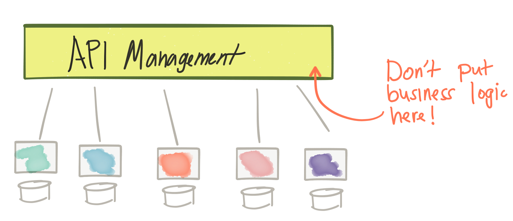
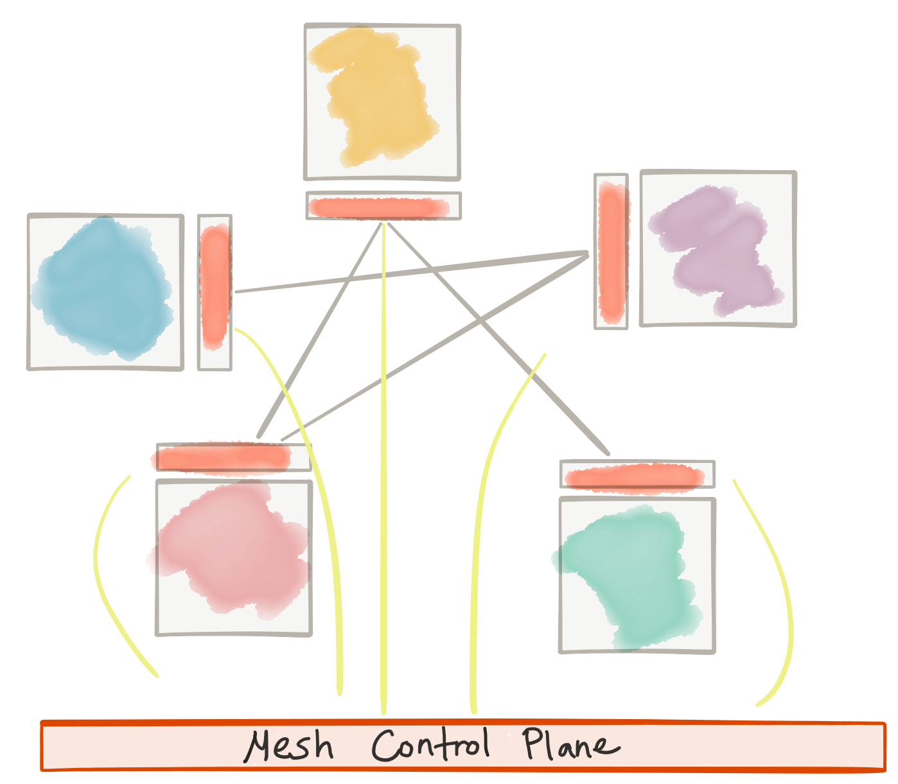
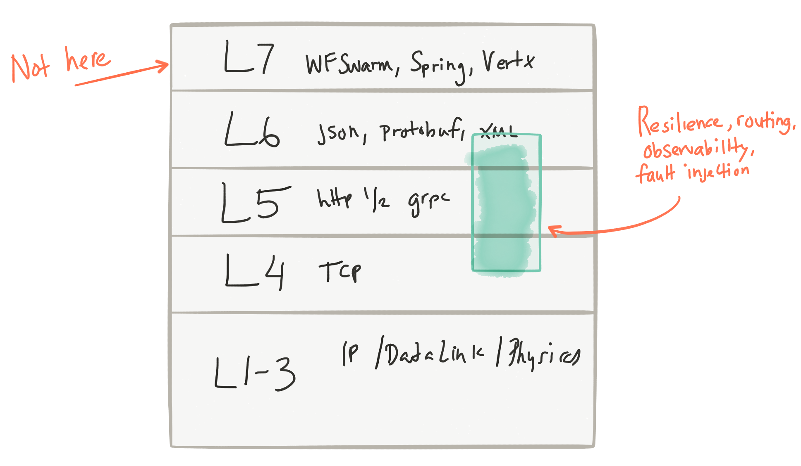
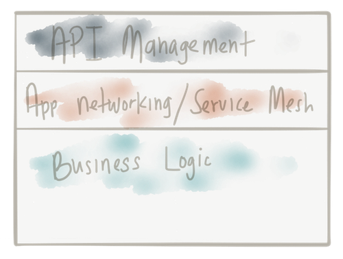

# 应用网络功能，ESB，API管理，而今..Service Mesh?

tags: Christian Posta

> 原文作者：[Christian Posta](https://twitter.com/burrsutter)
>
> 原文链接：[Application Network Functions With ESBs, API Management, and Now.. Service Mesh?](http://blog.christianposta.com/microservices/application-network-functions-with-esbs-api-management-and-now-service-mesh/)
>
> 转载地址：[原理解析Service Mesh与ESB、API管理与消息代理的关系](https://mp.weixin.qq.com/s?__biz=MzI5MDEzMzg5Nw==&mid=2660396277&idx=1&sn=e3fd0e49b4947e80fbfd3cdd781bad96&chksm=f7424e13c035c705401b08795eb5c494cd1001c39760bc603c377f550f999d5dc8355229b2f9&mpshare=1&scene=1&srcid=1108KXT47jsSir7gXXN7x1yj&pass_ticket=5n8O9dw5nrNWdp91I1Ex8q0wFqwN7oHELYvWuTB%2BJGXvmM0y3ASvIhOn%2FU9zG29J#rd)
>
> 译者：海松
>
> 声明：转载自微信公众号EAWorld

最近我谈到了[微服务模式的发展][]，以及像[service proxies like Envoy from Lyft][envoy]的文章，阐述服务代理如何将弹性、服务发现、路由、指标收集等职责推到应用程序下层。否则，我们只能寄希望于各种应用程序自己能正确实施这些关键功能，或依赖某个特定语言的库来实现这点。有趣的是，这种service mesh的思路与我们的企业领域客户熟悉的其他概念有关。我收到了很多关于这种关系的问题。具体来说，service mesh与ESB、消息代理和API Management的关系是什么？这些概念肯定有重叠，所以让我们来深挖一下。关注Twitter @christianposta了解更多信息！

## 四个假设

1. 服务通过网络进行通信

第一点：我们谈的服务是通过异步、包交换（packet-switched）网络进行通信和交互的服务。这意味着它们在自己的进程中运行，并且在自己的“时间边界”内（time boundaries，此处即异步的概念）中运行，且通过在网络中发送包进行通信。不幸的是，[没有任何东西可以保证异步网络交互][young-bloods]：我们最终可能会遇到交互失败、交互停滞/延迟等等，而且这些情况不好区分。

2. 如果仔细观察，这些交互并非微不足道

第二点：这些服务如何互相交互并非微不足道。我们必须处理以下事情，比如故障/部分成功、重试、重复检测、序列化/反序列化、语义/格式转换、多语言协议、路由到正确的服务来处理消息、处理消息洪泛（floods of messages）、服务编排、安全性影响等等。而其中许多事情可能而且必定会出错。

3. 了解网络非常重要

第三点：了解应用程序如何通信、消息如何交换以及如何控制流量非常重要。这点非常类似于我们如何看待第3/4层网络。了解以下内容是有价值的，如：哪些TCP段和IP数据包正穿过网络、控制路由它们和允许它们的规则等等。

4. 最终责任在应用程序

最后：正如通过[端到端的论证][endtoend]我们所知道的，应用程序本身应当负责其业务逻辑的安全性，保证正确的语义实现。无论底层基础设施（即使会遇到重试、交易、重复检测等等）的可靠性如何，我们的应用程序必须防范用户做出糊涂的行为（如同一命令重复提交）。提供实现或优化的细节能有助于帮助实现。但不幸的是，没有办法解决这个问题。

## 应用程序网络功能

我认为，无论你更倾向于哪个服务架构（微服务、SOA、对象请求代理、客户端/服务器等），以上要点都是有效的。然而，过去我们对于哪些优化属于哪里十分模糊。在我看来，不仅横向的应用程序网络功能可以从应用程序中被优化掉（然后被投入到基础设施中 - 就像我们在较低级别堆栈上所做的事情那样），而且还有其他应用程序网络功能与我们的业务逻辑更密切相关，但却不应该被轻易地“优化”（optimized）掉。

### 网络

让我们迅速回顾下应用程序之下的网络是什么样的，它可是地位超凡哦：）。当我们从一个服务发“消息”到另一个服务时，我们将其传递到了操作系统的网络堆栈，操作系统会尝试将这条消息放入网络中。根据网络所处级别，网络会处理传输单元（帧、数据报、数据包）等。这些传输单元通常包括一个由“数据头”和“有效负载”组成的结构，“数据头”包含关于传输单元的元数据。通过元数据，我们可以做很多基础的事情，例如路由、确认跟踪/去重等。

这些传输单元通过网络中的不同点进行发送，这些点决定了是否允许单元通过，是否将其路由到不同的网络，或将其传送到预期的接收者处。在路径上的任意一点，这些传输单元可能被丢弃、复制、重新排序或推迟。更高级的“可靠性”功能，如操作系统内网络堆栈中的TCP，则可以跟踪重复、确认、超时、排序、丢失的单元等东西，并可以进行故障重试、数据包重新排序等。

这类功能由基础设施提供，不与业务逻辑混合 – 而且其规模相当可观，达到了互联网规模！ 我刚看到的[Phil Calcado精彩的博客很好地解释了这点][pattern_service_mesh]。

### Application

在应用程序级别上，我们在做类似的事情。我们将与协作者服务的对话拆分成包含“消息”（请求、事件等）的传输单元。当我们通过网络进行调用时，我们必须能为应用程序消息执行超时、重试、确认、应用背压（apply backpressure）等操作。这些都是应用程序级别普遍的问题，并且在构建服务架构时总会出现。我们需要解决它们。我们需要一种实现应用网络功能的方法。

例如：过去我们尝试用邮件代理解决它们。有一组集中的面向消息的中间件（甚至可以通过多协议支持，使我们可以转换消息的有效负载，“集成”多个客户端），它们负责在客户端之间传递消息。我看到的很多例子使用的模式基本上是通过消息系统进行请求或回复（RPC）。

这间接帮助解决了应用程序网络功能中的一些问题。负载均衡、服务发现、背压、重试等工作都被委托给了消息代理。由于所有流量都要经过这些代理，所以我们有了一个中心点，从这个中心点可以观察和控制网络流量。但是，正如[@tef_ebooks在Twitter][tef_ebooks]上指出的那样，这种做法用力过度，有些矫枉过正了。它往往会成为架构的瓶颈，用它来进行流量控制、路由、策略执行等并不像我们想象那么容易。

所以我们也做过同样的尝试。我们觉得“好吧，就把路由、转换、策略控制”加到现有的集中式消息总线里吧。实际上这是个非常自然的演变。我们可以使用消息主干网（messaging backbone）来提供集中化、控制和应用程序网络功能，如服务发现、负载均衡、重试等等，但还要加入更多内容，比如协议调解、消息转换、消息路由、编排等功能，因为我们觉得如果可以将这些看似同一层面的内容加入到基础设施中，应用程序或许会更轻量、更精简、更敏捷等等。这些需求绝对是真实的，ESB演变并满足了这些需要。

正如我的同事[Wolfram Richter][]指出，“关于ESB概念，IBM关于SOA架构的2005年白皮书（http://signallake.com/innovation/soaNov05.pdf第2.3.1章）提供了如下的定义：

> 在SOA逻辑架构中，企业服务总线（ESB）是名安静的伙伴。它在体系结构中的存在对于SOA应用程序的服务来说几乎是透明的。然而，ESB的存在是简化服务调用的基础，使我们能随时随地调用服务，而无需定位服务或是上传服务请求这些细节。

这似乎是行得通的！甚至像我们正在尝试的新技术一样。**知道吗？我们的确是在尝试新技术！！！之前的问题并未奇迹般地消失**，只是背景和环境发生了变化。我们希望从过去未达成的目标中吸取经验。

例如，在大型供应商展望的SOA时代（通过委员会等方式编写无穷尽的规范、重命名EAI等），我们发现三件事导致了“ESB”的承诺未能实现：

• 组织结构（让我们不停地建造一个个竖井（silo）！）
• 技术复杂（SOAP/WS- *、JBI、规范XML、专有格式等）
• 需要业务逻辑来实现路由、转换、中介、编排等

而最后一点导致了过度操作。我们希望敏捷化，但我们将重要的业务逻辑从服务中分离出来，并转移到另一个团队拥有的集成层。现在，当我们想要更改服务时（出于敏捷的需要），我们做不到；我们不得不暂停并和ESB团队产生大量同步（这会带来风险）。随着这个团队和这个架构成为应用程序的中心，我们就可以理解ESB团队为什么会被请求所淹没（同样是因为敏捷的需要），无法跟上节奏了（即风险的体现）。所以尽管意图很好，但是我们发现把核心的应用程序联网功能与业务逻辑有关的功能混到一起不是个好主意。我们最终会遭遇瓶颈。

接下来出现的是REST革命和API优先的思潮。这一运动部分是出于对SOAP/ESB/SOA复杂性的抵制，部分是考虑通过API转换数据，引发新的商业模式，扩展现有模式。我们还向架构引入了新的基础设施：API管理网关。该网关让我们能集中地控制针对业务API的外部访问，它是通过安全ACL、访问配额和API使用计划、指标收集、计费、文档等实现的。然而，就像我们在前面的消息代理例子中看到的那样，当采用集中治理时，我们会有一次处理过多事情的风险。例如，我们会想，当API调用通过我们的网关时，为何不添加路由、转换和编排呢？然而，这样做的后果是我们开始妄想打造一个能够将基础设施级网络问题与业务逻辑相结合的ESB。这是一条死胡同。

但是，即使在REST/非SOAP时代，我们仍需要解决上述各项服务之间的问题，（不仅仅是所谓的“南北”流量（编者注：“North-South” traffic。网络传输的流量方向，南北一般指代纵向的不同层级间的传输流量，比如内外网，东西一般指代同一级别的传输流量，比如虚拟机之间），还包括“东西方”流量交互的问题）。更具挑战性的是，我们需要找出一种使用商用基础设施环境（又名云）的方法，而这种方法往往会加剧上述问题。传统信息代理、ESB等不适合这种模式。相反，我们最终会在业务逻辑中编写应用程序网络功能。……我们开始看到诸如[Netflix OSS堆栈][netflix]、[Twitter Finagle][finagle]这样的事物，甚至还有我们自己的Fuse Fabric，它们的确可以解决其中的一些问题。它们通常是库或框架，旨在解决上述一些问题，但它们是特定语言编写的，并且混合在业务逻辑中（或在整个基础设施中分散的业务逻辑中）。因此，这个模式也有问题。这种方法需要在每种语言/框架/运行环境上进行大量投资。我们基本上必须在跨语言/框架上加倍努力，并期望它们能够有效、正确和一致地工作。

经历了上述这些困难，在有能力控制/配置/监控应用级请求的前提下，我们能用最低的成本，高度分散（high decentralization）地将应用网络功能加入到基础设施中，从而解决上述的一些问题。我们称之为“service mesh”。基于[Envoy Proxy][envoyproxy]的[istio.io][istio]就是个很好的例子。它使我们将应用程序网络功能的问题与业务逻辑区分的问题分离开来：

正如[Phil Calcado说的那样][pattern_service_mesh]，这与TCP/IP网络层的工作非常相似；网络功能被推入到操作系统中，但它们并不是应用程序的一部分。

## 与此相关的概念

通过service mesh，我们明确地将应用程序网络功能与应用程序代码、业务逻辑分离开来，我们正在将其推向另一个层次（推向基础设施，这与我们在网络堆栈、TCP等方面所做的工作类似 ）。

所涉及的网络功能包括：

* 简单的、基于元数据的路由
* 自适应/客户端侧负载均衡
* 服务发现
* 熔断
* 超时/重试/预算
* 速率限制
* 度量/记录/追踪
* 故障注入
* A/B测试/流量整形/请求镜像

明确不含以下项目（这些项目可能更适合于业务层级的逻辑、应用程序和服务，而不是某些集中式基础设施。）：

* 消息转换
* 消息路由（基于内容的路由）
* 服务编排

那么service mesh与以下事物的不同点在于

### ESB

* 在某些网络功能上有重叠
* 控制点分散
* 策略针对特定应用程序
* 不处理业务逻辑问题（如映射、转换、基于内容的路由等）

### 消息代理

* 在服务发现、负载均衡、重试、背压等方面有重叠（大概差着30,000英尺）
* 控制点分散
* 策略针对特定应用程序
* 不承担发消息的职责

### API管理

* 在策略控制、速率限制、ACL，配额安全等方面有重叠
* 不处理API的业务方面（定价、文档、用户到计划的映射等）
* 类似点在于它不实现业务逻辑

至于API管理，似乎有一些重叠，但我更倾向于把这些重叠看作是高度互补。API管理提供有关API的更高级语义（如文档、用户注册/访问、生命周期管理、开发人员API计划、计费和退款等）。调用API时，较低级别的应用程序网络，如熔断器、超时、重试等都是至关重要的，但它们很适合service mesh层。重叠点如ACL、速率限制、配额和策略执行等可以由API管理层定义，但实际上由service mesh层实施。通过这种方式，我们可以拥有完整的端到端策略和访问控制，并强化南/北流量和东/西流量的弹性。如[@ZackButcher][ZackButcher]（来自Istio团队）在[twitter中][twitterz]指出那样，“随着规模越来越大，从生产和管理服务的角度来看，东西流量开始变得更像南北流量。”

## 把它们都整合起来

我们需要采用API优先的方法来处理我们的系统架构。我们也要解决弹性等问题。我们也发现了在集成上的挑战。在许多方面，将基于异步事件传递和事件处理的架构作为您的API和微服务交互的底层可以帮助提高可用性、弹性和降低脆性。过去，解决这些问题是一项挑战，因为竞争产品和解决方案的关注存在重叠和混淆。随着我们转向云架构，这种情况变得越来越明显，我们需要梳理这些问题，并将它们放在我们的架构中的适当位置，否则我们就会重蹈覆辙。

从上图可以看出：

* API管理用于进入的南/北流量
* service mesh（控制+数据层）用于服务之间的应用网络功能
* service mesh执行东西流量的API管理策略
* 集成（编排、转换、反损坏（anti-corruption）层）作为应用程序的一部分
* 事件驱动的消息底层（back plane），用于真正的异步/事件驱动的交互

如果我们回顾前面提到的四个假设，那么下面是我们如何解决它们的方法：

* 第一：服务通过网络进行交互 –我们使用service mesh数据层/服务代理
* 第二：交互并非微不足道的 –在业务本身实现业务集成
* 第三：控制和可观察性 –使用API管理加service mesh控制层
* 第四：您具体的业务逻辑；使用service mesh/消息传递等进行优化

## 业务逻辑真的可以被分离出来吗？

我想是可以的，但会存在不清晰的边界。在service mesh中，我们说应用程序应该能意识到应用程序网络功能，但是不应该在应用程序代码中被实现。如何使应用程序更清楚地意识到应用程序网络功能或service mesh层正在做什么事情，有待进一步说明。我认为在这种情况下，很多库或框架会被创建出来。例如，如果Istio service mesh触发熔断，重试一些请求，或者由于特定原因而失败，那么应用程序需要对这些场景有更多的上下文信息以供理解。我们需要一种方法来捕获这些情况或背景并将其反馈给服务。另一个例子是在服务之间传播跟踪背景（即分布式跟踪，如OpenTracing），并且透明地完成传播。我们或许会看到，这些轻型的应用程序/特定语言的库可以使应用程序/服务更智能，并允许它们追溯特定的错误。

## 我们该何去何从

今天这一架构的所有部分具有不同的成熟度。即使如此，对我们的服务架构采取原则化的方法是关键。业务逻辑与应用程序网络应该分开。使用service mesh实现应用程序网络，使用API管理层来处理高级别的以API为中心的问题，将让特定业务的集成放在服务层中。这样一来，我们就可以通过事件驱动的底层（backplane）构建数据密集型或数据可用系统。我认为当我们前进时，我们将不断地看到这些原则在具体的技术实现中被采用。在Red Hat（我工作的地方），我们看到诸如[3Scale][]、[Istio.io on Kubernetes][istio]、[Apache Camel][camel]和诸如[ActiveMQ Artemis][artemis]/[Apache Qpid Dispatch Router][dispatch-router]（包括非Red Hat技术，如[Apache KafkaIMHO][kafka]）的讯息技术正被作为强大的构建块来构建遵循以上原则的服务架构。

[微服务模式的发展]:http://blog.christianposta.com/microservices/the-hardest-part-of-microservices-calling-your-services/
[envoy]:http://blog.christianposta.com/microservices/00-microservices-patterns-with-envoy-proxy-series/
[young-bloods]:https://www.somethingsimilar.com/2013/01/14/notes-on-distributed-systems-for-young-bloods/
[endtoend]:http://web.mit.edu/Saltzer/www/publications/endtoend/endtoend.pdf
[pattern_service_mesh]:http://philcalcado.com/2017/08/03/pattern_service_mesh.html
[tef_ebooks]:https://twitter.com/tef_ebooks/status/875888701246722048
[Wolfram Richter]:https://twitter.com/_wolfram
[netflix]:https://netflix.github.io/
[finagle]:https://twitter.github.io/finagle/
[envoyproxy]:https://www.envoyproxy.io/
[istio]:https://istio.io/
[ZackButcher]:https://twitter.com/ZackButcher
[twitterz]:https://twitter.com/ZackButcher/status/894635529244770309
[3Scale]:https://www.3scale.net/
[camel]:https://camel.apache.org/
[artemis]:https://activemq.apache.org/artemis/
[dispatch-router]:http://qpid.apache.org/components/dispatch-router/index.html
[kafka]:http://kafka.apache.org/