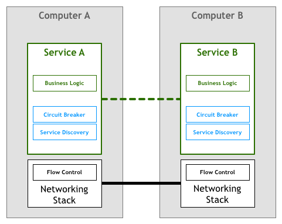
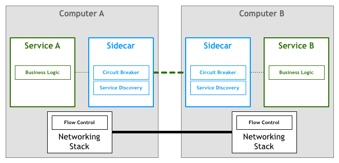

# 模式之服务网格

tags: Phil Calçado

> 原文作者：Phil Calçado
>
> 原文链接：[Pattern: Service Mesh](http://philcalcado.com/2017/08/03/pattern_service_mesh.html)
>
> 转载地址：[模式之服务网格](http://www.infoq.com/cn/articles/pattern-service-mesh?from=awesome-servicemesh)
>
> 译者：薛命灯
>
> 声明：转载自InfoQ

分布式系统为我们带来了各种可能性，同时也引入了各种问题。如果系统不是很复杂，工程师们一般会尽量避免进行远程交互，降低分布式系统与生俱来的复杂性。使用分布式系统最安全的方式就是尽可能避免分布式，尽管这样会让散布的系统出现重复的逻辑和数据。

但行业的发展促使我们迈出更大的步伐，大型的集中式服务变成了数百个甚至数千个小型服务。我们不得不去解决新的挑战，先是一些个别案例，后来问题变得越来越复杂。在不断挖掘出新问题并设计出更好的解决方案之后，我们开始学会总结，将一些常见的需求总结成模式、库，甚至是平台。

## 最初的网络计算机交互

最开始人们想象的计算机之间的交互方式是这样的：

一个服务通过与另一个服务发生对话来完成用户的请求。我们看到的是最最简单的视图，因为底层很多信息都被屏蔽掉了，比如那些负责传输字节码的层和传输电子信号的层。下面我们给出稍微详细一点的组件图：

上面这个模型的变种从50年代开始就得到广泛应用。起初，计算机很稀有，也很昂贵，人们手动管理计算机之间的连接。随着计算机变得越来越普及，价格也没那么贵了，计算机之间的连接数量和数据量出现了疯狂式的增长。人们越来越依赖网络系统，工程师们必须确保他们开发的服务能够满足用户的要求。

于是，如何提升系统质量成为人们关注的焦点。机器需要知道如何找到其他节点，处理同一个通道上的并发连接，与非直接连接的机器发生通信，通过网络路由数据包，加密流量……

除此之外，还需要流量控制机制。流量控制可以防止上游服务器给下游服务器发送过多的数据包。在网络系统中，至少会存在两台对彼此毫无所知的机器。比如，服务器A按照一定速率向服务器B发送数据包，但服务器B并不能保证及时处理这些数据包。服务器B有可能同时在处理其他任务，又或者数据包到达的顺序发生颠倒，服务器B一直在等待本应先到达的数据包。在这种情况下，不仅服务器A的请求无法得到响应，而且还可能让服务器B过载，因为服务器B需要把数据包放进未处理队列。

在一段时期内，开发人员需要在自己的代码里处理上述问题。在下图的示例中，为了确保不给其他服务造成过载，应用程序需要处理网络逻辑，于是网络逻辑和业务逻辑就混杂在一起。

所幸的是，技术发展得很快，TCP/IP这类标准的出现解决了流量控制等问题。尽管网络逻辑代码依然存在，但已经从应用程序里抽离出来，成为操作系统网络层的一部分。

## 微服务的出现

时过境迁，计算机越来越普及，也越来越便宜，上述的网络技术栈已经被证实是构建可靠连接系统行之有效的方案。相互连接的节点越来越多，业界出现了各种网络系统，如分布式代理和面向服务架构。

分布式为我们带来了更高层次的能力和好处，但挑战依然存在。有些挑战是全新的，但也有一些只是旧有问题的升级，比如我们之前讨论的网络问题。

在90年代，来自Sun Microsystems的Peter Deutsch等人发表了“[The8 Fallacies of Distributed Computing](https://en.wikipedia.org/wiki/Fallacies_of_distributed_computing)”。Peter列出了人们在使用分布式系统时容易做出的几项假设。Peter指出，如果只是针对原始网络架构或理论模型，那么这些假设或许是对的，但在现实世界中绝对不是。

1. 网络是可靠的
1. 没有延迟
1. 带宽是无限的
1. 网络是安全的
1. 拓扑结构不会发生变化
1. 存在网络管理员
1. 零传输成本
1. 网络是同质的

工程师不能忽略这些“谬论”，他们必须在开发当中处理这些问题。

微服务架构是更为复杂的分布式系统，它给运维带来了更多挑战。我们之前已经做过一些详细的讨论，下面是之前讨论内容的要点。

1. 快速分配计算资源
1. 基本的监控
1. 快速部署
1. 易于分配的存储
1. 易于访问的边界
1. 认证和授权
1. 标准的RPC

尽管数十年前出现的TCP/IP协议栈和通用网络模型仍然是计算机通信最为有力的工具，但一些更为复杂的架构也催生了一些新的需求，工程师们需要在系统中加入一个新的层。

我们以服务发现和回路断路器为例，这两种技术被用于解决弹性和分布式问题。

历史总是惊人的相似，第一批采用微服务架构的企业遵循的是与第一代网络计算机系统类似的策略。也就是说，解决网络通信问题的任务又落在了工程师的肩上。

服务发现的目的是找到有能力处理请求的服务实例。比如，有个叫作Teams的服务需要找到一个叫作Players的服务实例。通过调用服务发现，可以获得一个满足条件的服务器清单。对于单体系统来说，这个可以通过DNS、负载均衡器和端口机制（比如通过HTTP服务器的8080端口来绑定服务）来实现。而在分布式系统里，事情就复杂了，服务发现需要处理更多的任务，比如客户端负载均衡、多环境（如staging环境和生产环境）、分布式服务器的物理位置等。之前可能只需要一行代码来处理服务器名问题，而现在需要更多的代码来处理更多的边界问题。

Michael Nygard在他的“[Release It](http://amzn.to/2viDf23)”一书中提到了回路断路器模式。Martin Fowler也对该模式做了总结：

> 回路断路器背后的原理其实很简单，将函数封装在回路断路器对象里，当故障率达到某个阈值，回路断路器开始发挥作用，所有发给回路断路器的请求都将返回错误，这些请求无法触及到被保护的函数。通常情况下，还需要在回路断路器打开时发出告警。

这是一种非常简单但能保证服务间交互可靠性的解决方案。不过，随着分布式规模的增长，任何事情都会趋于复杂。在分布式系统里，发生问题的概率呈指数级增长，即使是最简单的事情也不能等闲视之，比如像“在回路断路器打开时发出告警”这样的小事。一个组件发生故障将会级联地影响到多个客户端，一传十，十传百，最后可能有数千个回路同时被打开。先前的问题只需要几行代码就可以解决，而现在需要更多的代码才能解决这些新问题。

要实现好上述的两种模式是很困难的，不过像Twitter的[Finagle](https://finagle.github.io/)和Facebook的[Proxygen](https://code.facebook.com/posts/1503205539947302)这样的大型框架为我们提供了很多便利。

很多采用了微服务架构的公司遵循了上图中的模型，如Netflix、Twitter和SoundCloud。不过随着服务数量的增长，这个模型也时常出现一些问题。

即使一个公司使用了Finagle，仍然需要投入时间和精力去打通各个系统。从我在SoundCloud和DigitalOcean的经验来看，一个拥有100到250个工程师的企业，至少需要投入十分之一的人力在构建工具上。这种成本有时候是显而易见的，因为一部分工程师被安排专职负责构建工具，但有时候它也会存在于无形，并“吞噬”掉本该用于构建产品的时间。

第二个问题是，上述的方案会限制可用的工具、运行时和编程语言。微服务软件库一般专注于某个平台，使用了某种编程语言或使用了某种运行时（如JVM）。如果一个公司选择了另一个不支持原先软件库的平台，那么就要将代码重新移植到新平台上。移植过程需要耗费大量的工程时间，工程师们忙于构建工具和基础设施，无暇顾及业务和产品。这也就是为什么一些中型公司决定只支持单一的平台，比如SoundCloud仅支持Scala，DigitalOcean仅支持Go语言。

最后一个是监管问题。尽管软件库封装了功能，但组件本身仍然需要维护。要确保数千个服务使用的是同一个版本（或至少是兼容的版本）的软件库并不是件容易的事。每做出一次变更都需要进行集成、测试，还要重新部署所有的服务——尽管服务本身并没有发生变化。

## 下一步

与网络协议栈一样，我们急切地希望能够将分布式服务所需要的一些特性放到底层的平台中。

人们基于HTTP协议开发非常复杂的应用，无需关心底层TCP如何控制数据包。在开发微服务时也是类似的，工程师们聚焦在业务逻辑上，不需要浪费时间去编写服务基础设施代码或管理系统用到的软件库和框架。

把这种想法囊括进我们的架构中，就是下图所示的样子。

不过，在网络协议栈中加入这样的一个层是不实际的。很多先驱者们使用一系列代理，也就是说，一个服务不会直接与它的依赖项发生连接，所有的流量都会流经代理，代理会实现所有必需的特性。

在首批有文档记录的开发案例中，出现了边车（sidecar）这个概念。边车就是与应用程序一起运行的独立进程，为应用程序提供额外的功能。2013年，Airbnb开发了[Synapse和Nerve](https://medium.com/airbnb-engineering/smartstack-service-discovery-in-the-cloud-4b8a080de619)，也就是边车的一种开源实现。一年之后，Netflix发布了[Prana](https://medium.com/netflix-techblog/prana-a-sidecar-for-your-netflix-paas-based-applications-and-services-258a5790a015)，它也是一个边车，可以让非JVM应用接入他们的NetflixOSS生态系统。在SoundCloud，我们也开发了一些边车，让遗留的Ruby应用可以使用我们为JVM微服务而构建的基础设施。

大多数开源的代理是为特定的基础设施组件而设计的。例如，Airbnb的Nerve和Synapse假设服务一定是注册到ZooKeeper上的，而Prana要求一定要使用Netflix自己的[Eureka注册服务](https://github.com/Netflix/eureka)。

随着微服务架构日渐流行，我们也看到了新一波的代理可以用在不同基础设施组件上。[Linkerd](https://buoyant.io/2016/02/18/linkerd-twitter-style-operability-for-microservices/)就是其中较为出名的一个，它是Buoyant公司基于Twitter微服务平台而开发的。而不久之前，Lyft宣布[Envoy](https://eng.lyft.com/announcing-envoy-c-l7-proxy-and-communication-bus-92520b6c8191)成为CNCF的官方项目。

## Service Mesh（服务网格）

在这样的模型里，每个服务都会有一个边车代理与之配对。服务间通信都是通过边车代理进行的，于是我们就会得到如下的部署图。

Buoyant的CEO [William Morgan](https://en.wikipedia.org/wiki/Mesh_networking)发现，代理之间的连接形成了一种网格网络。2017年初，William对这样的平台做出了定义，并称之为Service Mesh：

> 服务网格是一个基础设施层，用于处理服务间通信。云原生应用有着复杂的服务拓扑，服务网格保证请求可以在这些拓扑中可靠地穿梭。在实际应用当中，服务网格通常是由一系列轻量级的网络代理组成的，它们与应用程序部署在一起，但应用程序不需要知道它们的存在。

这个定义最强有力的部分在于，它不再把代理看成单独的组件，并强调了这些代理所形成的网络的重要性。

组织开始将他们的微服务部署到更为复杂的运行时（如Kubernetes和Mesos）上，并开始使用这些平台提供的网格网络工具。他们正从使用一系列独立运行的代理转向使用集中式的控制面板。

从鸟瞰图中可以看到，服务的实际流量仍然在代理间流转，不过控制面板对每一个代理实例了如指掌，通过控制面板可以实现代理的访问控制和度量指标收集。

最近发布的[Istio](https://istio.io/)就是这类系统最为突出的代表。

我们还无法对Service Mesh将给大规模系统带来怎样的影响做出全面的定论，不过我们至少可以看到两个方面的优势。首先，微服务架构的一些公共组件已经是现成的，很多小公司可以享受到之前只有大公司才能享受的一些特性。其次，我们或许能够因此使用最好的工具和编程语言，而无需担心不同平台对软件库和模式的支持存在差异。

